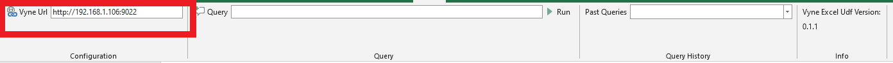
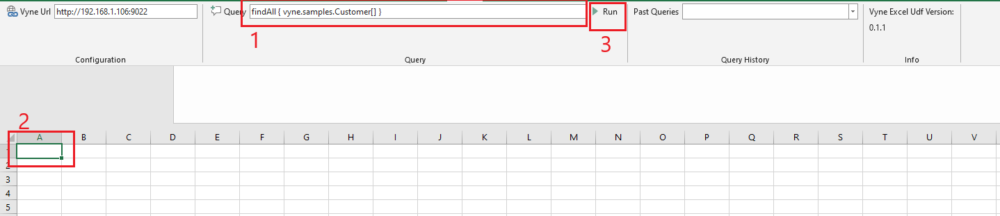
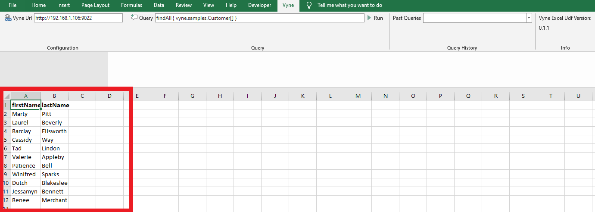

# Using Vyne Excel Plugin

After installing the plugin create a blank Workbook or open an existing one. We need to configure, the plugin and set the vyne query service Url before start issuing VyneQl Queries from the plugin:

1. Click on 'Vyne Ribbon' and enter the Url that you use to access Vyne from your browser into 'Vyne url' edit box.

2. Type Your Query into 'Query' editor, click on an empty cell in the workbook and click on 'Run' button to execute the query.

3. Once the query execution is completed, the result is displayed in the workbook starting from the selected cell in step 2

