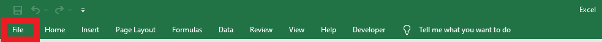
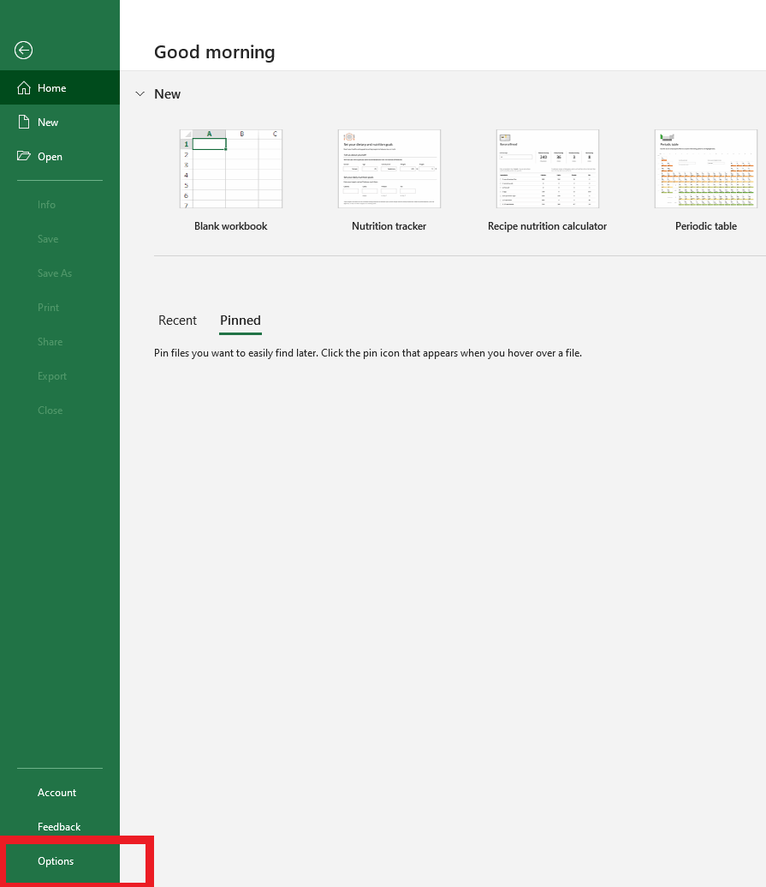
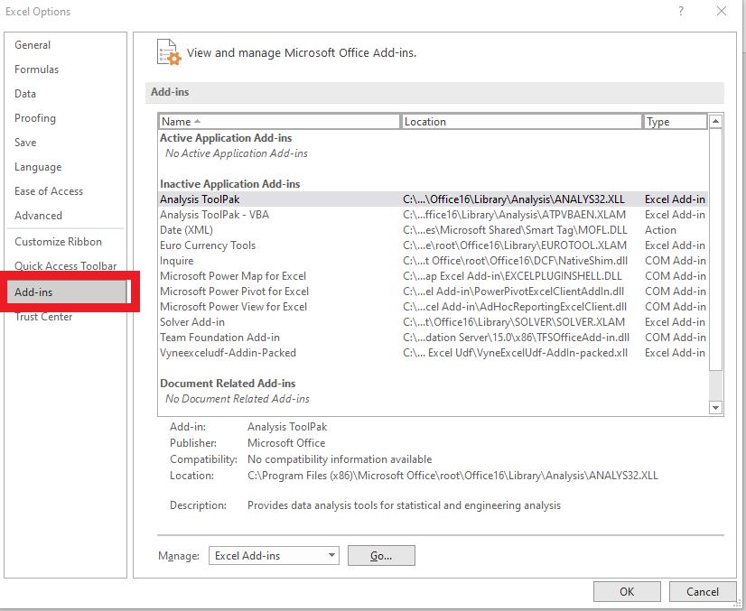
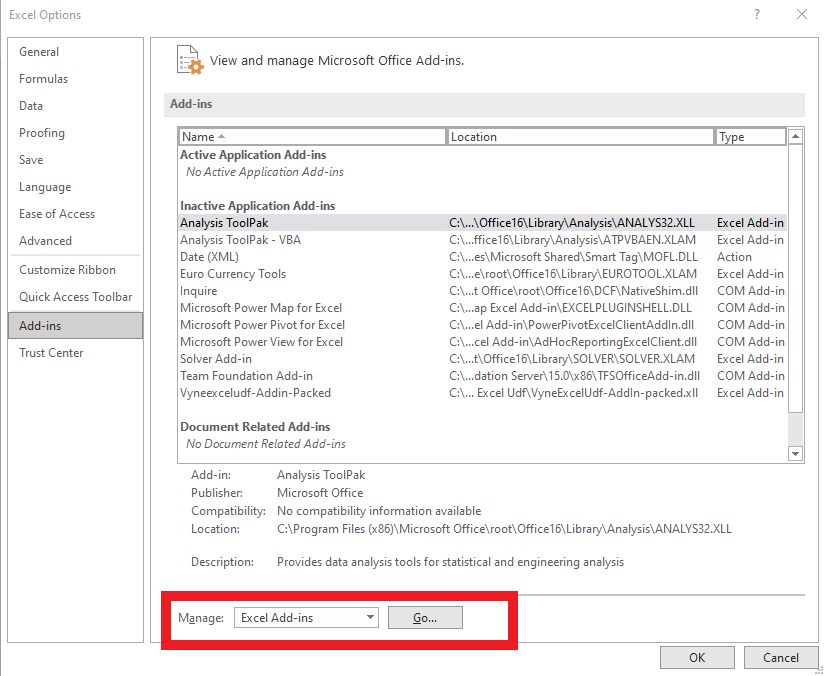
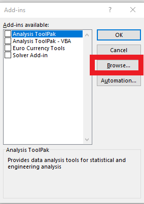
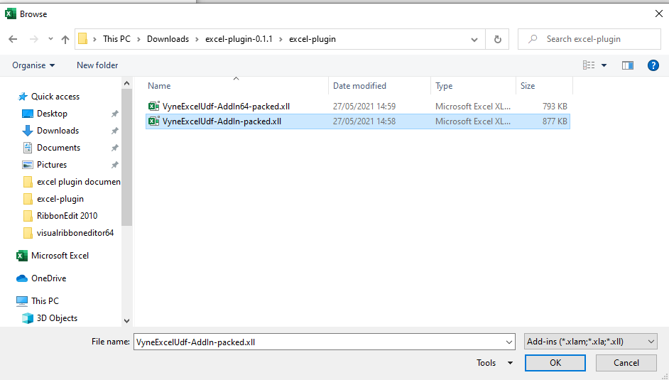
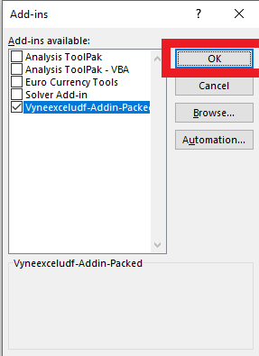
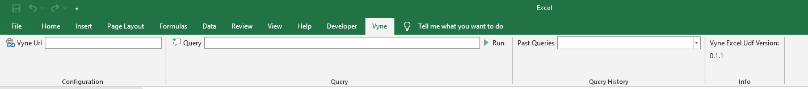

# Installing Vyne Excel Plugin

Before Installing the plugin, you need to make sure that:

* .NET Framework 4.6 or later is installed.
* Your Excel Version is large than equal to 2007.

## Steps

1. Download the [Latest](http://repo.vyne.co/release/io/vyne/excel-plugin/0.1.1/excel-plugin-0.1.1.zip) install package.
2. Extract the package
3. Package contains two versions of the addin:
   * 64 bit version: 
   ```
   VyneExcelUdf-AddIn64-packed.xll
   ```
   * 32 bit version:
   ```
    VyneExcelUdf-AddIn-packed.xll
   ```
4. Open Your Excel and click on 'File'



5. Click on 'Options'
   
   

6. Select 'Add-ins'



7. Select 'Excel-Addins' in 'Manage' drop-down and click on 'Go'



8. Click on 'Browse'



9. Based on your excel version, select either  VyneExcelUdf-AddIn64-packed.xll or  VyneExcelUdf-AddIn-packed.xll from the extracted file location.




10. Clicn on 'OK' to complete the installation



11. If the installation is successful, you should see the 'Vyne' Ribbon

